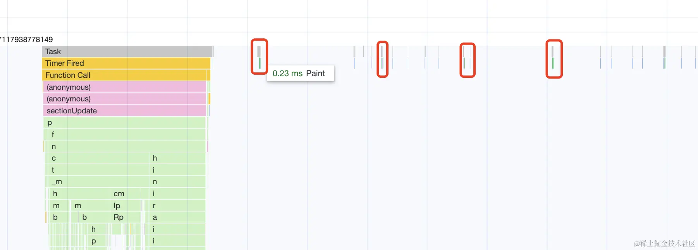
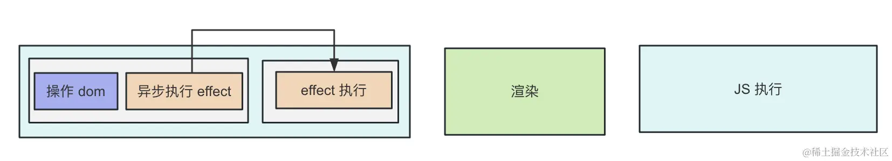
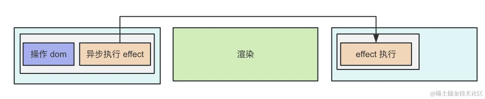
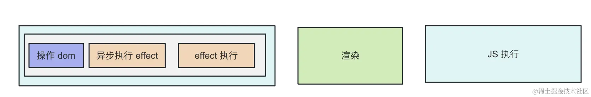
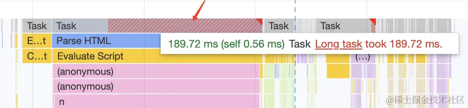

---

---

### useEffect

#### **注意**

想用 `async await` 语法需要单独写一个函数，因为 useEffect 参数的那个函数不支持 `async`。

```tsx
import { useEffect, useState } from "react";

async function queryData() {
  const data = await new Promise<number>((resolve) => {
    setTimeout(() => {
      resolve(666);
    }, 2000);
  })
  return data;
}

function App() {
  const [num, setNum] = useState(0);

  useEffect(() => {
    queryData().then(data => {
      setNum(data);
    })
  }, []);

  return (
    <div onClick={() => setNum((prevNum) => prevNum + 1)}>{num}</div>
  );
}

export default App;
```

#### 第二个参数传空数组

- 这个数组叫做依赖数组，react 是根据它有没有变来决定是否执行 effect 函数的，如果没传则每次都执行。

```tsx
useEffect(() => {
    console.log('只执行一次');
}, [1,3,4]);  // 任意常量也是不会触发更新的
```

```tsx
useEffect(() => {
    console.log('Date.now()');
}, [Date.now()]);  // Date.now() 改变就会一直更新
```

#### 第二个参数传state

- 这个数组我们一般写依赖的 state，这样在 state 变了之后就会触发重新执行了。

```tsx
const [count, setCount] = useState(0);

const onChange = (e) => {
    setCount(e.target.value)
}

useEffect(() => {
    console.log('count 变化是更新');
}, [count]);
```

#### 第二个参数不传

- 不传 deps 数组的时候也是每次都会重新执行 effect 函数

```tsx
useEffect(() => {
    console.log('每次都执行');
});
```

#### useEffect 中定时器清理

- 当 deps 数组变了，重新执行 effect 之前，会先执行清理函数，打印了 clean up。

- 组件销毁时也会调用 cleanup 函数来进行清理。

```tsx
import { useEffect, useState } from "react";

function App() {
  const [num, setNum] = useState(0);

  useEffect(() => {
    console.log('effect')
    const timer = setInterval(() => {
      console.log(num);
    }, 1000);

    return () => {
      console.log('clean up')
      clearInterval(timer);
    }
  }, [num]);

  return (
    <div onClick={() => setNum((prevNum) => prevNum + 1)}>{num}</div>
  );
}

export default App;

```

### useLayoutEffect

- 和 useEffect 类似的还有一个 useLayoutEffect。

- 绝大多数情况下，你把 useEffect 换成 useLayoutEffect 也一样
- 那为什么需要俩个呢？

```tsx
 useLayoutEffect(() => {
     console.log('1111')
    queryData().then(data => {
      setNum(data);
    })
  }, [1,2,3, Date.now()]);
```

**都知道js执行和渲染都是阻塞的**

| JS执行 | 渲染 | JS执行 |
| :----: | :--: | :----: |

**useEffect 的Effect函数会在操作dom之后异步执行**

| 操作DOM                    异步执行effect | 渲染 | effect执行 |
| :---------------------------------------- | :--: | :--------: |

- 异步执行就是用setTimeout, Promise.then 等api包裹执行的逻辑
- 这些逻辑会以单独的宏任务或者微任务的形式存在，然后进入 Event Loop 调度执行。
- 控制台 打开 Permormance 工具，可以看到 Event Loop 的详情



- 可以看到，渲染的间隔是固定的，而 js 的任务在这些渲染的间隔中执行。

- 所以异步执行的 effect 逻辑就有两种可能





- 灰色的部分是单独的任务。

- 有可能在下次渲染之前，就能执行完这个 effect。

- 也有可能下次渲染前，没时间执行这个 effect，所以就在渲染之后执行了。

- 这样就导致有的时候页面会出现闪动，因为第一次渲染的时候的 state 是之前的值，渲染完之后执行 effect 改了 state，在此渲染就是新的值了。

- 一般这样也没啥问题，但如果你遇到这种情况，不想闪动那一下，就用 useLayoutEffect。

- 它的 useEffect 的区别是它的 effect 执行是同步的，也就是在同一个任务里



- 这样浏览器会等 effect 逻辑执行完再渲染。

- 好处自然就是不会闪动了。

- 但坏处也很明显，如果你的 effect 逻辑要执行很久呢？

- 不就阻塞渲染了？

- 超过 `50ms` 的任务就被称作长任务，会`阻塞渲染`，`导致掉帧`



- 所以说，一般情况下，还是让 effect 逻辑异步执行的好。

- 也就是说，绝大多数情况下，用 useEffect，它能避免因为 effect 逻辑执行时间长导致页面卡顿（掉帧）。 但如果你遇到闪动的问题比较严重，那可以用 useLayoutEffect，但要注意 effect 逻辑不要执行时间太长。

- 同步、异步执行 effect 都各有各的问题和好处，所以 React 暴露了 useEffect 和 useLayoutEffect 这两个 hook 出来，让开发者自己决定。

### useReducer

#### useReducer

- 前面用的 setState 都是直接修改值，那如果在修改值之前需要执行一些固定的逻辑呢？

- 这时候就要用 useReducer 了

```tsx
import { Reducer, useReducer } from "react";

interface Data {
  result: number;
}

interface Action {
  type: "add" | "minus";
  num: number;
}

function reducer(state: Data, action: Action) {
  switch (action.type) {
    case "add":
      return {
        result: state.result + action.num,
      };
    case "minus":
      return {
        result: state.result - action.num,
      };
  }
}

function App() {
  // useReducer 的类型参数传入 Reducer<数据的类型，action 的类型>
  // 然后第一个参数是 reducer，第二个参数是初始数据。
  const [state, dispatch] = useReducer<Reducer<Data, Action>>(reducer, {
    result: 0,
  });

  return (
    <div>
	  {/* 点击加的时候，触发 add 的 action，点击减的时候，触发 minus 的 action */}          
      <button onClick={() => dispatch({ type: "add", num: 2 })}>加</button>
      <button onClick={() => dispatch({ type: "minus", num: 1 })}>减</button>
      <div>{state.result}</div>
    </div>
  );
}

export default App;

```

你可能会觉得用useState  更方便

```js
function App() {
  const [res, setRes] = useState({ result: 0});
  return (
    <div>
        <div onClick={() => setRes({ result: res.result + 2 })}>加</div>
        <div onClick={() => setRes({ result: res.result - 1 })}>减</div>
    </div>
  );
}
```

这种简单的也确实没必要用useReducer

#### useReducer + immer

**使用 reducer 有一个特别要注意的地方**

```js
function reducer(state: Data, action: Action) {
  // 如果你直接修改原始的 state 返回，是触发不了重新渲染的：
  switch (action.type) {
    case "add":
      state.count += action.count
      return state
      };
  }
}
```

- 如果直接修改原始的 state 返回，是触发不了重新渲染的,必须返回一个新的对象才行

- 但这也有个问题，如果对象结构很复杂，每次都创建一个新的对象会比较繁琐，而且性能也不好

```js
import { Reducer, useReducer } from "react";

interface Data {
    a: {
        c: {
            e: number,
            f: number
        },
        d: number
    },
    b: number
}

interface Action {
    type: 'add',
    num: number
}

function reducer(state: Data, action: Action) {

    switch(action.type) {
        case 'add':
            return {
                ...state,
                a: {
                    ...state.a,
                    c: {
                        ...state.a.c,
                        e: state.a.c.e + action.num,
                    },
                },
            }
    }
    return state;
}

function App() {
  const [res, dispatch] = useReducer<Reducer<Data, Action>, string>(reducer, 'zero', (param) => {
    return {
        a: {
            c: {
                e: 0,
                f: 0
            },
            d: 0
        },
        b: 0
    }
  });

  return (
    <div>
        <div onClick={() => dispatch({ type: 'add', num: 2 })}>加</div>
        <div>{JSON.stringify(res)}</div>
    </div>
  );
}

export default App;
```

- 这里的 data 是一个复杂的对象结构，我们需要改的是其中的一个属性，但是为了创建新对象，要把其余属性依次复制一遍。

#### immer

```bash
npm install --save immer
```

```js
import { produce } from "immer";
function reducer(state: Data, action: Action) {
  switch (action.type) {
    case "add":
      return produce(state, (draft) => {
        draft.a.c.e += action.num;
      });
  }
}
```

- 第一个参数是要修改的对象，第二个参数的函数里直接修改这个对象的属性，返回的结果就是一个新的对象

- immer 是依赖 Proxy 实现的，它会监听你在函数里对属性的修改，然后帮你创建一个新对象。

- 刚才只说了 reducer 需要返回一个新的对象，才会触发渲染，其实 useState 也是

#### exmple

```js
import { useState } from "react";

function App() {
    const [obj, setObj] = useState({
        a: {
            c: {
                e: 0,
                f: 0
            },
            d: 0
        },
        b: 0
    });

    return (
        <div>
            <div onClick={() => {
                obj.a.c.e ++;
                setObj(obj);
            }}>加</div>
            <div>{JSON.stringify(obj)}</div>
        </div>
    );
}
// 因为对象引用没变，同样不会重新渲染
// 使用immer

setObj(produce(obj, (obj) => {
    obj.a.c.e ++;
}))

```

- **在 react 里，只要涉及到 state 的修改，就必须返回新的对象，不管是 useState 还是 useReducer。**

- 如果是复杂的深层对象的修改，可以用 immer 来优化
